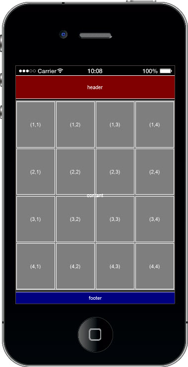
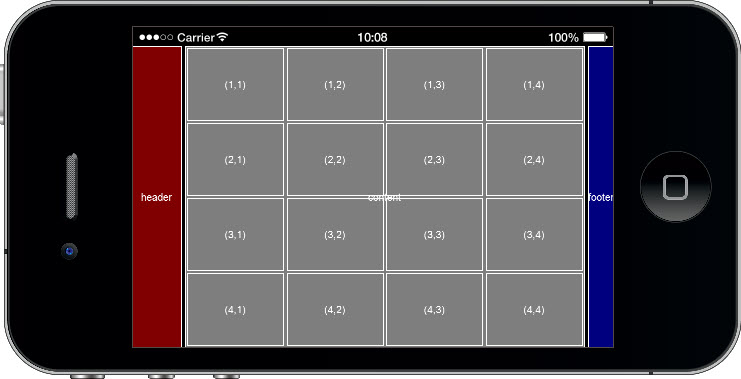
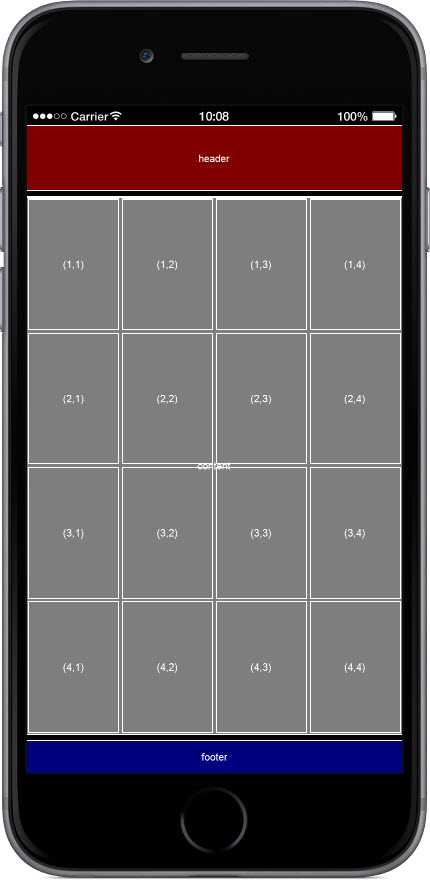
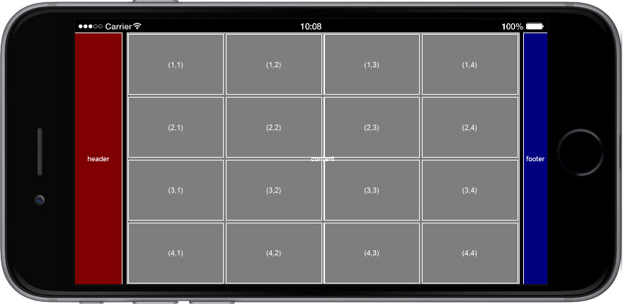
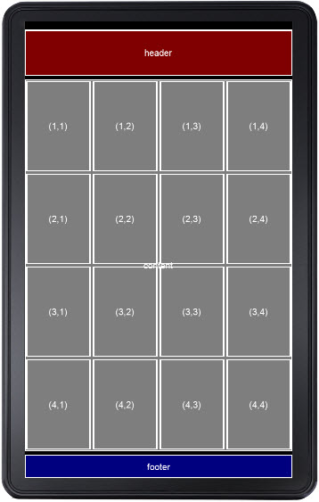
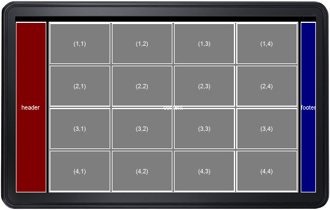
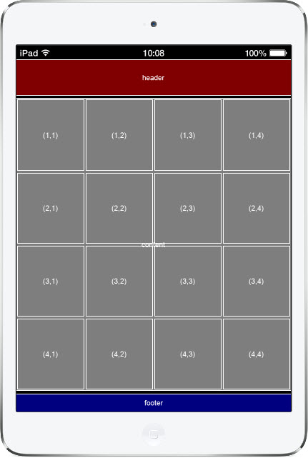
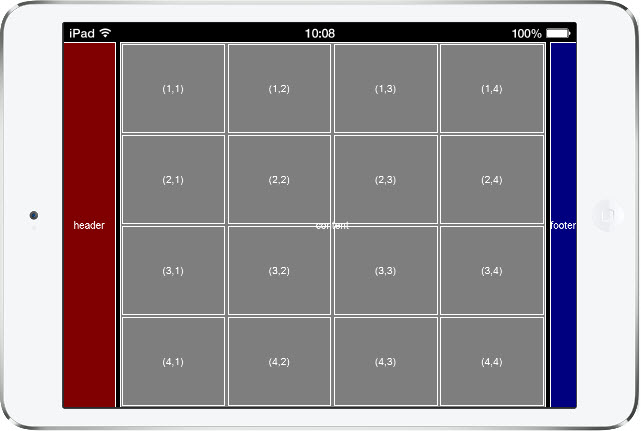

# layout.lua

A simple but powerful device and display-size independent layout manager for the Corona SDK.

## Overview

The layout manager makes it easy to create *regions*, rectangular areas defined relative to the screen, the stage (which may or may not be the full screen), and to the previously created user-defined regions. The final regions are created with content coordinates. No actual display objects are created, the programmer is free to utilize the defined regions in any manner. There are default 'screen' and 'stage' regions, but the real power of the layout manager is its ability to easily define new regions using simple but powerful positioning and sizing options relative to any region that already exists.

**See [doc/index.html](doc/index.html) for the full documentation.**

## Examples

Several source examples are provided (see the Examples listing in [doc/index.html](doc/index.html)), below are screen captures of [example-05.lua](doc/examples/example-05.lua.html).

In the given example, a "header" region is first defined as 10% of the vertical stage, relative to the top of the stage. The "content" region is then created positioned "below" the "header" with a small bit of padding. A "footer" region is created as 5% of the vertical stage, and positioned to the "bottom" of the "stage". Finally the grid regions generated relative to the top and left of the "content" region, see the code for full details, the number of regions and the spacing between them can be adjusted by manipulating a couple of variables near the top of the code.

_Note that it is the same code for all devices_, the layout manager is device and resolution independent, basing regions on relative area and distance and creating them in content units.

### iPhone 4 Portrait:

### iPhone 4 Landscape:

### iPhone 6 Portrait:

### iPhone 6 Landscape:

### Kindle Fire Portrait

### Kindle Fire Landscape

### iPad Mini Portrait

### iPad Mini Landscape

## Author

[Ron Pacheco](ron@wolfden.pub)
[Wolfden Publishing, LLC](http://www.wolfden.pub/)

## License

[MIT](https://github.com/wolfdenpublishing/layout/blob/master/LICENSE)